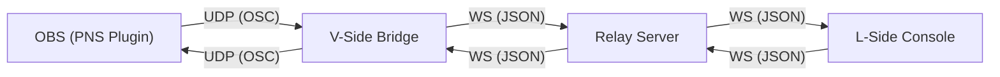

# Remote Fader & Metering System (v1.0)

A real-time remote audio mixing console for VTubers and Live Houses. This system allows a sound engineer to control OBS audio sources remotely while monitoring peak levels in real-time.

## Project Structure

- `OSCVOL.cxx`: PNS (Plug'n Script) AngelScript for OBS. Handles filtering, gain, and peak detection.
- `v-side-bridge/`: Node.js relay bridge for the VTuber side.
  - `index.js`: OSC (UDP) <-> WebSocket (JSON) engine.
  - `index.html`: Monitoring UI (Status & Logs).
  - `test_peak_simulator.js`: Utility to simulate OBS meter data.
- `relay-server/`: WebSocket broadcast relay for remote communication.
- `l-side-console/`: Premium React interface for the mixing engineer.

## Architecture



## Quick Start (Local Setup)

1. **Install Dependencies** (if not already done):
   ```bash
   cd relay-server && npm install
   cd ../v-side-bridge && npm install
   cd ../l-side-console && npm install
   ```

2. **Launch All Services**:
   ```bash
   chmod +x start_all.sh
   ./start_all.sh
   ```

3. **Open Dashboards**:
   - **Mixing Console**: [http://localhost:5173/](http://localhost:5173/)
   - **VTuber Bridge Monitor**: [http://localhost:3001/](http://localhost:3001/)

4. **Simulate Audio (Optional)**:
   To see the meters moving without opening OBS:
   ```bash
   cd v-side-bridge && node test_peak_simulator.js
   ```

## Deploying for Remote Usage

To use this across different networks:
1. Deploy `relay-server/` to a cloud provider (e.g., Render, Fly.io, or AWS).
2. Update `RELAY_URL` in `v-side-bridge/index.js` and `L-Side Console` to your public URL.
3. Share the `L-Side Console` URL with your engineer.

## Technical Notes

- **UDP Ports**: 
  - 9000 (Bridge Input from PNS)
  - 8000 (Bridge Output to PNS)
- **JSON Protocol**:
  - `{"id": 0, "type": "gain", "value": 0.75}`
  - `{"id": 0, "type": "meter", "value": -12.5}`
